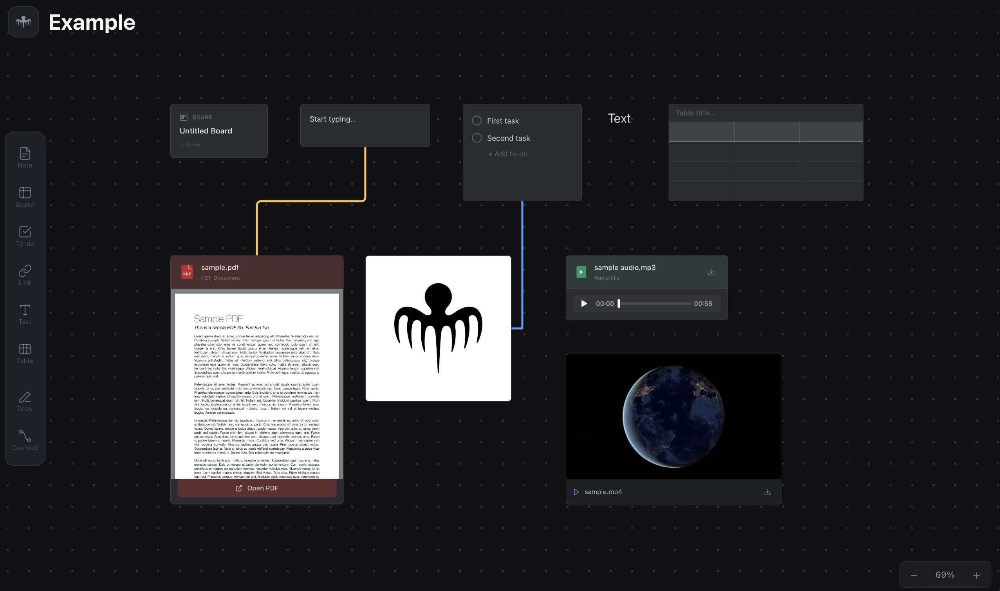
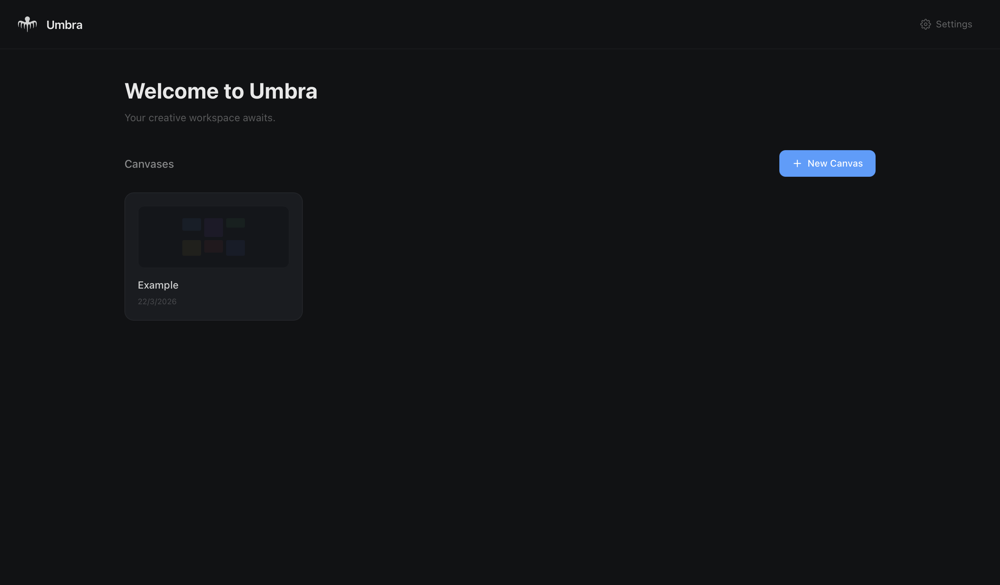

# Umbra

A native macOS infinite canvas editor — inspired by Milanote and Apple Freeform. Built with **Tauri 2**, **React 19**, **Zustand**, and **Tailwind CSS**.



## Features

- **Infinite canvas** with dot grid, smooth pan (Alt+drag / Space+drag), and zoom (Cmd+scroll)
- **Notes** — rich sticky notes with color themes (default, yellow, pink, blue, green)
- **Boards** — nestable sub-canvases; double-click to drill in, breadcrumb to navigate back
- **Checklists** — to-do lists with checkable items
- **Tables** — resizable grid with per-cell bold/italic/strikethrough, shading, and adjustable cell height
- **Text blocks** — free-floating text with font size, color, alignment, and formatting
- **Links** — paste a URL and get a live preview card with favicon, title, and description
- **Images** — drag and drop images from disk onto the canvas
- **Files** — drag any file onto the canvas; open in system default app
- **Freehand drawing** — pen tool with color and thickness options
- **Connectors** — link any two elements with straight, elbow, or curved arrows; customizable color and thickness
- **Marquee selection** — drag to select multiple elements (including connectors)
- **Keyboard shortcuts** — copy/paste, duplicate, select all, nudge, delete, undo/redo
- **Workspaces** — multiple canvases with a home dashboard
- **Dark mode** — fully dark UI throughout
- **Persistence** — auto-saves to localStorage and Tauri disk (`state.json`)



## Tech Stack

| Layer | Technology |
|---|---|
| Desktop shell | Tauri v2 (Rust + WKWebView) |
| Frontend | React 19, TypeScript 5 |
| State management | Zustand 5 + Immer |
| Styling | Tailwind CSS v3 |
| Build | Vite 6 |

## Getting Started

### Prerequisites

- **Node.js** >= 20
- **Rust** (latest stable) — [install via rustup](https://rustup.rs)
- **Xcode Command Line Tools** — `xcode-select --install`

### Install and Run

```bash
# Install dependencies
npm install

# Run the desktop app (recommended)
npm run tauri dev

# Or run browser-only for frontend work
npm run dev
```

### Build

```bash
# Production build — generates .app and .dmg in src-tauri/target/release/bundle/
npm run tauri build
```

## Project Structure

```
src/
  App.tsx                              # Root: home view vs canvas workspace
  store/useBoardStore.ts               # Zustand store — all state and actions
  features/
    canvas/
      InfiniteCanvas.tsx               # Pan, zoom, marquee, connectors, drawing
      connectorGeometry.ts             # Connector path math (straight/elbow/curve)
    elements/
      CanvasElementCard.tsx            # Renders all element types
    toolbar/
      LeftToolbar.tsx                  # Tool buttons, draw/connect settings panels
      ElementSettingsPanel.tsx         # Per-element settings (color, style, etc.)
      ToolbarIcons.tsx                 # SVG icon components
    home/
      HomePage.tsx                     # Workspace grid dashboard
    navigation/
      BreadcrumbNav.tsx                # Board drill-down breadcrumbs
  types/
    elements.ts                        # BoardElement interface, ElementType union
    workspace.ts                       # Workspace, settings types
  lib/
    desktopApi.ts                      # Tauri IPC wrappers
    canvasDnD.ts                       # Drag & drop (toolbar + file drop)
    useKeyboardShortcuts.ts            # Cmd+C/V/A/D, Delete, arrows, Escape

src-tauri/
  src/main.rs                          # Rust backend: save/load state, asset management
  tauri.conf.json                      # Tauri config (window, bundle, security)
  Cargo.toml                           # Rust dependencies
```

## Keyboard Shortcuts

| Shortcut | Action |
|---|---|
| `Cmd+A` | Select all |
| `Cmd+C` / `Cmd+V` | Copy / Paste |
| `Cmd+D` | Duplicate |
| `Cmd+Z` / `Cmd+Shift+Z` | Undo / Redo |
| `Arrow keys` | Nudge 10px (Shift = 50px) |
| `Delete` / `Backspace` | Delete selected |
| `Escape` | Deselect |
| `Space + drag` | Pan canvas |
| `Alt + drag` | Pan canvas |
| `Cmd + scroll` | Zoom |
| `Double-click canvas` | Create note |
| `Double-click board` | Drill into board |

## License

[MIT](LICENSE)
